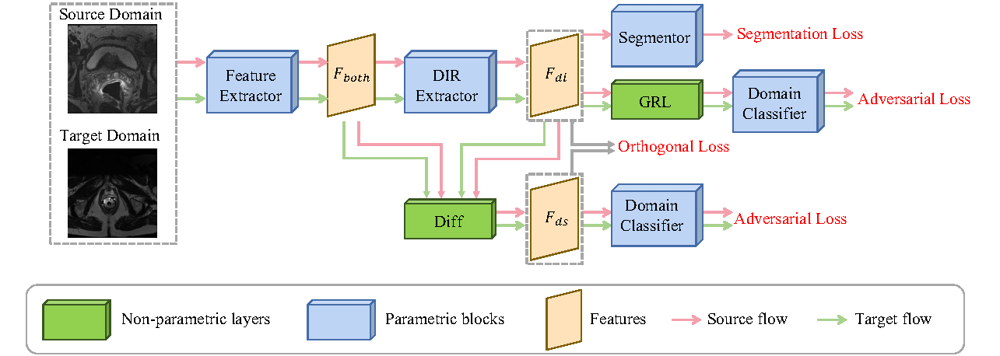
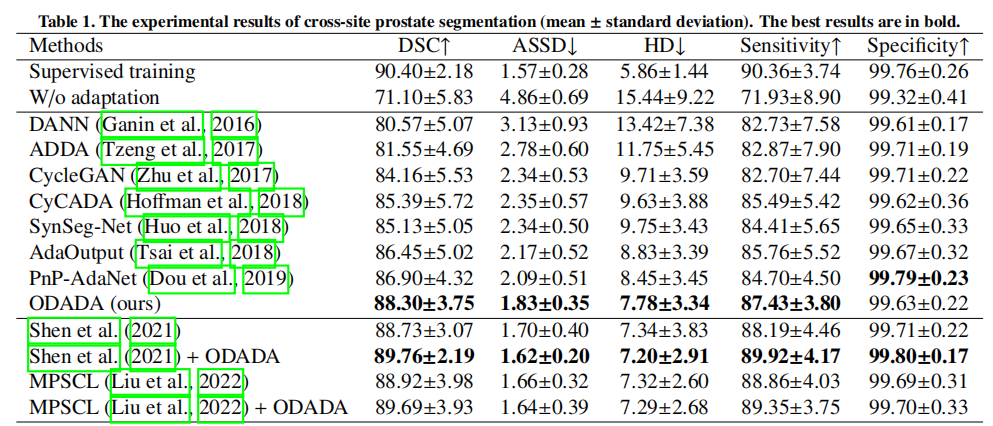

## Rethinking adversarial domain adaptation: Orthogonal decomposition for unsupervised domain adaptation in medical image segmentation
This repository provides the code for "Rethinking adversarial domain adaptation: Orthogonal decomposition for unsupervised domain adaptation in medical image segmentation". Our work is accepted by MedIA [mia_link].


[mia_link]:https://www.sciencedirect.com/science/article/abs/pii/S1361841522002511


Fig. 1. Structure of ODADA.


### Requirementss
Some important required packages include:
* [Pytorch][torch_link] version >=0.4.1.
* Python == 3.7 
* Some basic python packages such as Numpy.

Follow official guidance to install [Pytorch][torch_link].

[torch_link]:https://pytorch.org/

## Usages
### For multi-site prastate segmentation


1. To train ODADA for multi-site prostate segmentation, run:
```
python main.py
```

2. Our experimental results are shown in the table:



## Citation
If you find our work is helpful for your research, please consider to cite:
```
@article{sun2022rethinking,
  title={Rethinking adversarial domain adaptation: Orthogonal decomposition for unsupervised domain adaptation in medical image segmentation},
  author={Sun, Yongheng and Dai, Duwei and Xu, Songhua},
  journal={Medical Image Analysis},
  pages={102623},
  year={2022},
  publisher={Elsevier}
}
```
